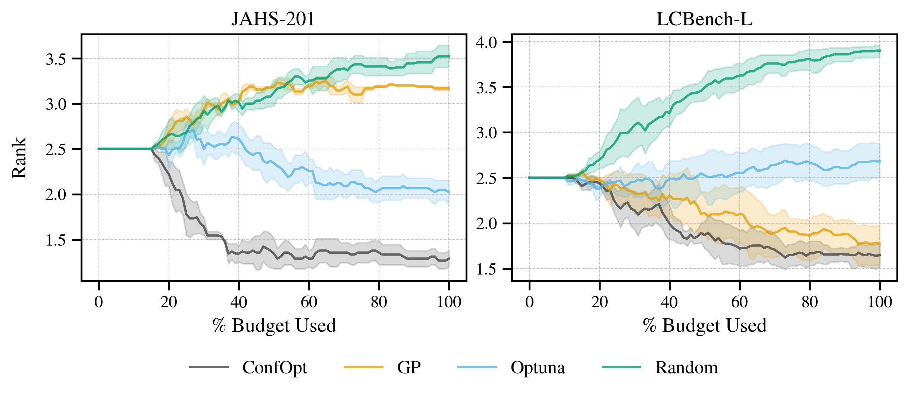

`ConfOpt <https://github.com/rick12000/confopt>`_ is a flexible hyperparameter optimization library, blending the strenghts of quantile regression with the calibration of conformal prediction.

Find out how to **include it in your ML workflow** below! 👇

.. toctree::
   :maxdepth: 1
   :caption: User Guide

   installation
   getting_started
   advanced_usage

.. toctree::
   :maxdepth: 1
   :caption: Developer Guide
   :hidden:

   api_reference
   architecture

.. toctree::
   :maxdepth: 1
   :caption: Other
   :hidden:

   roadmap
   contact

📈 Benchmarks
=============

**ConfOpt** is significantly better than plain old random search, but it also beats established tools like **Optuna** or traditional **Gaussian Processes**!

The above benchmark considers neural architecture search on complex image recognition datasets (JAHS-201) and neural network tuning on tabular classification datasets (LCBench-L).

For a fuller analysis of caveats and benchmarking results, refer to the latest methodological paper.

🔬 Theory
==========

ConfOpt implements surrogate models and acquisition functions from the following papers:

- **Adaptive Conformal Hyperparameter Optimization**: `arXiv, 2022 <https://doi.org/10.48550/arXiv.2207.03017>`_

- **Optimizing Hyperparameters with Conformal Quantile Regression**: `PMLR, 2023 <https://proceedings.mlr.press/v202/salinas23a/salinas23a.pdf>`_
